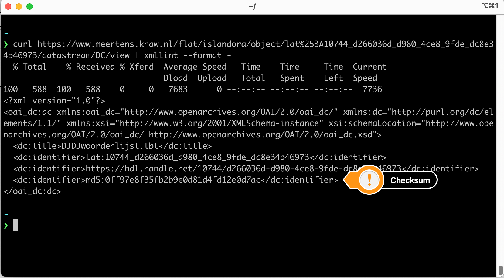
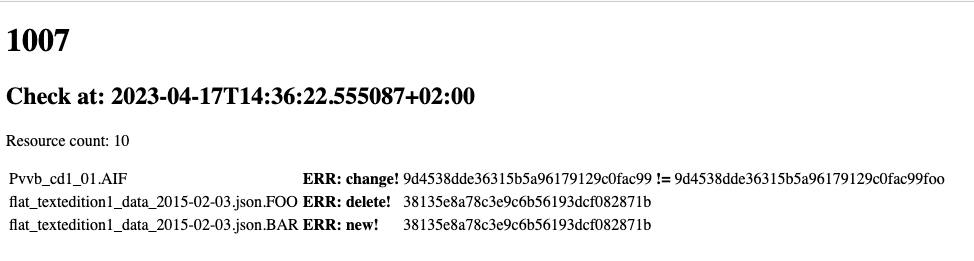
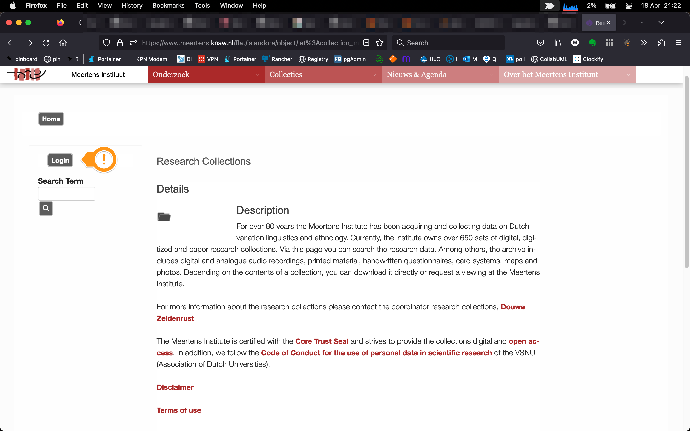
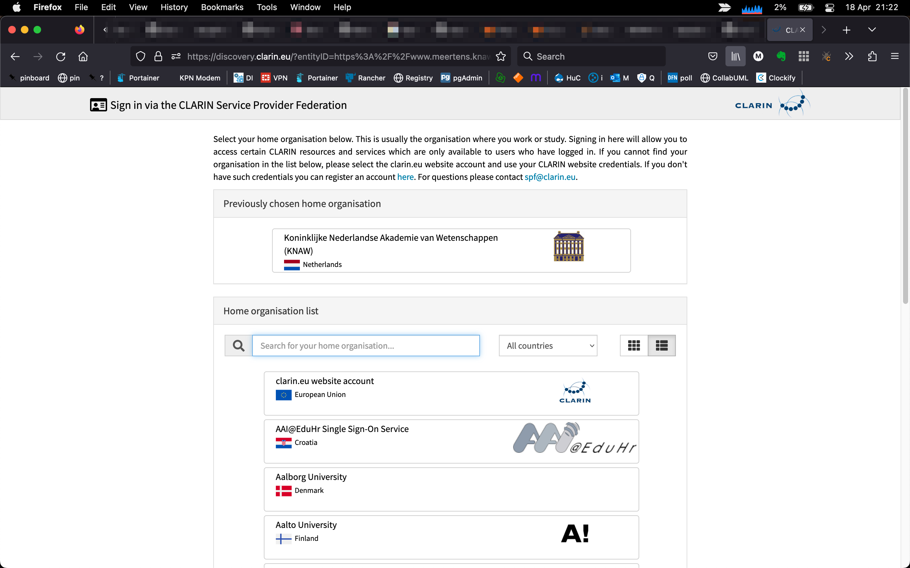
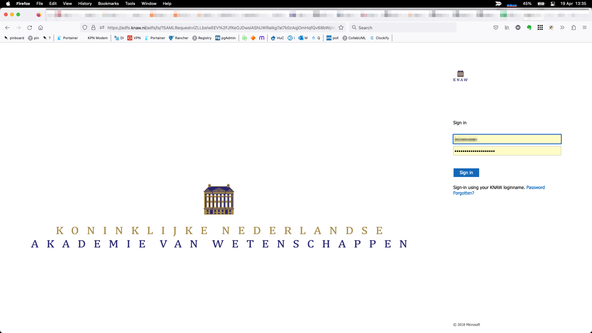
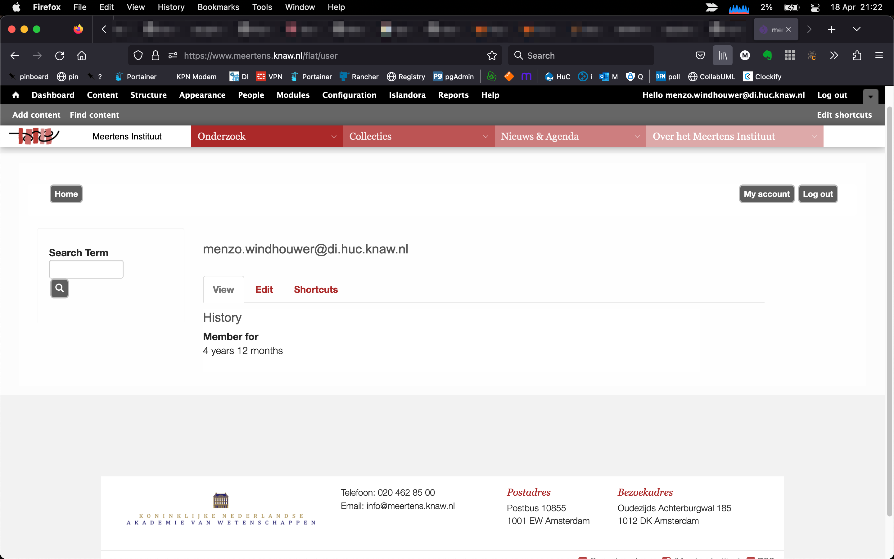

## R7 Data integrity and authenticity

# Data integrity 

Upon ingest the checksums are calculated by [FITS](https://projects.iq.harvard.edu/fits) and stored alongside the metadata:

These checksums are weekly checked against the actual resources on disk. Here is an example report for collection 1007 (with some engineered errors):

The completeness of the metadata is validated by a CMDI profile, i.e., on the collection level that is [the Meertens Collection profile](https://menzowindhouwer.github.io/lab/cr2html/#clarin.eu:cr1:p_1440426460262) and on deeper levels more collection specific profiles can be used, e.g., [a Roots of Etnolect conversation](https://menzowindhouwer.github.io/lab/cr2html/#clarin.eu:cr1:p_1454489235460). Next to this basic XSD validation also a Schematron validation with Institute specific rules, e.g., which CMDI profiles are supported, is run. If one of these results in an error submission is impossible. Warnings are passed on to the collection manager, who will resolve them with or without the depositor.

# Data authenticity 

All changes to a dataset are logged in the audit trail offered as the default functionaility of the Fedora repository system.

The repository system offers versioning support for both metadata and data. Where older versions remain available via their handles. Another option is to put versions explicitly next to each other, distinguished by versioning information, e.g., a year, into the title.  Which version strategy is applied to an update of a dataset is determined by the collection manager together with the depositor.

The server running the repository interface is a member of the CLARIN Server Provider Federation: https://github.com/clarin-eric/SPF-SPs-metadata/blob/master/metadata/www.meertens.knaw.nl%252FShibboleth.sso%252FMetadata.xml Depositors thus login using their credentials from their home institute. Using this mechanism the identities of the depositors are guaranteed by their home institutions. Here is an example of the login flow:

1. login link at the repository frontend:

2. Where are you from:

3. authentication at the home institution:

4. user profile at the repository:

